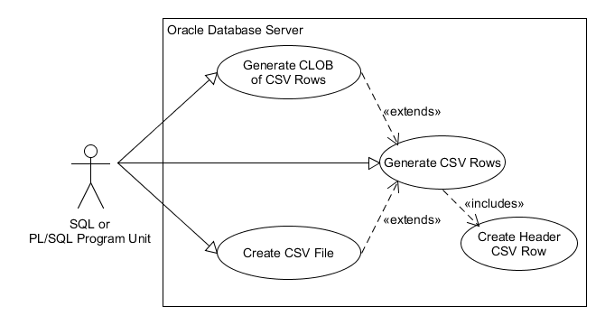

# app_csv_udt - An Oracle PL/SQL CSV Record Generator

Create Comma Separated Value strings (rows) from an Oracle query. 

A CSV row will have the separator between each field
(can be any separator character, but comma (',') and pipe ('|') are most common).
There is no separator after the last field (which
would make it a delimited file rather than separated).

If a field contains the separator
character or newline, then the field value is enclosed in double quotes. In that case, if the field 
also contains double quotes, then those are doubled up 
per [RFC4180](https://www.loc.gov/preservation/digital/formats/fdd/fdd000323.shtml).

The resulting set of strings (rows) can be written to a file, collected into a CLOB, or returned from 
a "TABLE" function in a SQL query via PIPE ROW. Alternatively, you can loop through the rows (strings) as
they are returned from the cursor.

# Content

- [Installation](#installation)
- [Use Cases](#use-cases)
    - [Generate CSV Rows](#generate-csv-rows)
    - [Create CSV FIle](#create-csv-file)
    - [Generate CLOB of CSV Rows](#generate-clob-of-csv-rows)
    - [Process Results in a Loop](#process-results-in-a-loop)
- [Test Directory](#test-directory)
- [Manual Page](#manual-page)
    - [app_csv_udt constructor](#app_csv_udt_constructor)
    - [get_rows](#get_rows)
    - [get_clob](#get_clob)
    - [write_file](#write_file)
    - [get_row_count](#get_row_count)
    - [get_ctx](#get_ctx)
    - [set_column_name](#set_column_name)
    - [get_column_names](#get_column_names)
    - [get_column_types](#get_column_types)
    - [set_fmt](#set_fmt)
    - [get_header_row](#get_header_row)
    - [get_next_row](#get_next_row)

# Installation

Clone this repository or download it as a [zip](https://github.com/lee-lindley/app_csv_udt/archive/refs/heads/main.zip) archive.

Note: [plsql_utilties](https://github.com/lee-lindley/plsql_utilities) is provided as a submodule,
so use the clone command with recursive-submodules option:

`git clone --recursive-submodules https://github.com/lee-lindley/app_csv_udt.git`

or download it separately as a zip 
archive ([plsql_utilities.zip](https://github.com/lee-lindley/plsql_utilities/archive/refs/heads/main.zip)),
and extract the content of root folder into *plsql_utilities* folder.

## install.sql

If you already have a suitable TABLE type, you can update the sqlplus define variable *d_arr_varchar2_udt*
and set the define *compile_arr_varchar2_udt* to FALSE in the install file. You can change the name
of the type with *d_arr_varchar2_udt* and keep *compile_arr_varchar2_udt* as TRUE in which case
it will compile the appropriate type with your name.

Same can be done for *d_arr_integer_udt*, *d_arr_clob_udt* and *d_arr_arr_clob_udt*.

You could also edit *app_csv_udt.tps* and *app_csv_udt.tpb* to
change the return type of *get_rows* to TABLE of CLOB if you have a need for rows longer than 4000 chars 
in a TABLE function callable from SQL. If you are dealing exclusively in PL/SQL, the rows are already CLOB.

Once you complete any changes to *install.sql*, run it with sqlplus:

`sqlplus YourLoginConnectionString @install.sql`

# Use Cases

 

## Generate CSV Rows

You can use a simple SQL SELECT to read CSV strings as records from the TABLE function *get_rows*, perhaps
spooling them to a text file with sqlplus. Given how frequently I've seen a cobbled together
SELECT concatenting multiple fields and separators into one value, this may
be the most common use case.

The following is *test1.sql* from the *test* directory.

```sql
    set echo off
    set linesize 200
    set pagesize 0
    set heading off
    set trimspool on
    set feedback off
    spool test1.csv
    SELECT a.column_value FROM TABLE(
            app_csv_udt.get_rows(CURSOR(SELECT * FROM hr.departments ORDER BY department_name)
                                ,p_separator=> '|'
                                ,p_do_header => 'Y'
                                )
        ) a
    ;
    spool off
```

## Create CSV File

Produce a CSV file on the Oracle server in a directory to which you have write access. Presumably
you have a process that can then access the file, perhaps sending it to a vendor. *test/test3.sql*
is a contrived example of writing the file, then using TO_CLOB(BFILENAME()) to retrieve it in a SQL statement.

```sql
    DECLARE
        v_src   SYS_REFCURSOR;
        v_csv   app_csv_udt;
    BEGIN
        OPEN v_src FOR SELECT * FROM (
            SELECT TO_CHAR(employee_id) AS "Emp ID", last_name||', '||first_name AS "Fname", hire_date AS "Date,Hire,YYYYMMDD", salary AS "Salary"
            from hr.employees
            UNION ALL
            SELECT '999' AS "Emp ID", 'Baggins, Bilbo "badboy"' AS "Fname", TO_DATE('19991231','YYYYMMDD') AS "Date,Hire,YYYYMMDD", 123.45 AS "Salary"
            FROM dual
        ) ORDER BY "Fname" ;
        v_csv := app_csv_udt(
            p_cursor        => v_src
            ,p_num_format  => '$999,999.99'
            ,p_date_format  => 'YYYYMMDD'
        );
        v_csv.write_file(p_dir => 'TMP_DIR', p_file_name => 'x.csv', p_do_header => 'Y');
    END;
    /
    set echo off
    set linesize 200
    set pagesize 0
    set heading off
    set trimspool on
    set feedback off
    set long 90000
    set serveroutput on
    spool test3.csv
    SELECT TO_CLOB(BFILENAME('TMP_DIR','x.csv')) FROM dual
    ;
    spool off
```

## Generate CLOB of CSV Rows

The CSV strings can be concatenated into a CLOB with linefeed (or CR/LF) after each row. The resulting CLOB can be
attached to an e-mail, written to a file or inserted/updated to a CLOB column in a table. Perhaps
added to a zip archive. There are many possibilites once you have the CSV content in a CLOB.
See *test/test2.sql* for an example function you can call in a SQL select.

```sql
    DECLARE
        l_clob  CLOB;
        l_csv   app_csv_udt;
    BEGIN
        l_csv := app_csv_udt(
            p_sql           => 'SELECT * FROM hr.departments ORDER BY department_name'
            ,p_num_format   => '099999'
        );
        l_csv.get_clob(p_clob => l_clob, p_do_header => 'Y', p_separator => '|');
        ...
    END;
```

## Process Results in a Loop

Although you could run a SELECT from the TABLE function *get_rows* in an implied cursor loop, 
you can also simply step through
the results the same way the preceding methods do. Perhaps you have a more involved use case such
as sending the resulting rows to multiple destinations, or creating a trailer record.

```sql
    DECLARE
        l_rec   CLOB;
        l_file  UTL_FILE.file_type;
        l_csv   app_csv_udt;
    BEGIN
        l_csv := app_csv_udt(
            p_cursor                => 'SELECT * FROM hr.departments'
            ,p_quote_all_strings    => 'Y'
        );
        l_csv.get_next_row(p_clob => l_rec);
        IF l_rec IS NOT NULL THEN -- do not want to write anything unless we have data from the cursor
            l_file := UTL_FILE.fopen(
                filename        => 'my_file_name.csv'
                ,location       => 'MY_DIR'
                ,open_mode      => 'w'
                ,max_linesize   => 32767
            );
            UTL_FILE.put_line(l_file, l_csv.get_header_row);
            LOOP
                UTL_FILE.put_line(l_file, l_rec);
                l_csv.get_next_row(p_clob => l_rec);
                EXIT WHEN l_rec IS NULL;
            END LOOP;
            UTL_FILE.put_line(l_file, '---RECORD COUNT: '||TO_CHAR(l_csv.get_row_count));
            UTL_FILE.fclose(v_file);
        END IF;
    END;
```

# Test Directory

The *test* directory contains sql files and corresponding CSV outputs. These samples demonstrate much of the 
available functionality. *test3.sql* and *test4.sql* explore quoting and leading/trailing spaces.

# Manual Page

## app_csv_udt constructor

Creates the object using the provided cursor or SQL string. Prepares for reading and converting the result set.

```sql
    CONSTRUCTOR FUNCTION app_csv_utd(
        p_cursor                SYS_REFCURSOR
        ,p_separator            VARCHAR2 := ','
        ,p_quote_all_strings    VARCHAR2 := 'N'
        ,p_strip_separator      VARCHAR2 := 'N' -- strip comma from fields rather than quote
        ,p_bulk_count           INTEGER := 100
        ,p_num_format           VARCHAR2 := 'tm9'
        ,p_date_format          VARCHAR2 := 'MM/DD/YYYY'
        ,p_interval_format      VARCHAR2 := NULL
        ,p_protect_numstr_from_excel    VARCHAR2 := 'N'
    ) RETURN SELF AS RESULT
--
    CONSTRUCTOR FUNCTION app_csv_utd(
        p_sql                   CLOB
        ,p_separator            VARCHAR2 := ','
        ,p_quote_all_strings    VARCHAR2 := 'N'
        ,p_strip_separator      VARCHAR2 := 'N' -- strip comma from fields rather than quote
        ,p_bulk_count           INTEGER := 100
        ,p_num_format           VARCHAR2 := 'tm9'
        ,p_date_format          VARCHAR2 := 'MM/DD/YYYY'
        ,p_interval_format      VARCHAR2 := NULL
        ,p_protect_numstr_from_excel    VARCHAR2 := 'N'
    ) RETURN SELF AS RESULT
```

*p_sql* is a string containing a SQL statement that is converted into a SYS_REFCURSOR for you as a convenience.

*p_cursor* is a ref cursor which is more flexible than a simple SQL string since it can use
bind variables. That includes binding arrays as tables you can select from.

*p_separator* is intended to be a single character. The attribute is 2 characters wide if you want to try it that way.

*p_num_format*, *p_interval_format*, and *p_date_format* are passed to *TO_CHAR* for number, interval,
and date/time formats respectively.
If NULL, then *TO_CHAR* is called without the second argument. Other non-character column types
receive the default conversion to character. BLOB and BFILE are returned as NULL. You can also specify
a TO_CHAR conversion format at the column level. See [set_fmt](#set_fmt).

*p_bulk_count* is the number of records DBMS_SQL will read in each fetch.

When *p_strip_separator* starts with a 'Y' or 'y', then the separator character is stripped from all column values
and column header names.

When *p_quote_all_strings* starts with a 'Y' or 'y', then all character type values are enclosed in double quotes,
not just the ones that contain a separator or newline. This applies to the column header names as well. This is significant
when there are leading or trailing spaces as the default behavior is to trim those from character type column values.
See *test3* and *test4* "Baggins" records for examples.

Note that numbers and dates can be double quoted. Consider a number format of '$999,999.99' with a comma separator,
or perhaps a date format that includes a colon with a colon separator.
Luckily, Excel figures that all out just fine and treats them as numbers and dates anyway.

*p_protect_numstr_from_excel* handles the
flip side of Excel treating strings that look like numbers as numbers even when you do not want it too.
Consider an ID field that is a VARCHAR2 that contains leading zeros like '00123456'. Excel turns that into 123456.
If you set *p_protect_numstr_from_excel* to 'Y', we will look at all fields that are Character types in the 
input resultset to see if they match regular expression '^(\s*[+-]?(\d+[.]?\d*)|([.]\d+))$' and would be treated
by excel as a number. If so, we use magic pixie dust to encase your number lookalike string with "=""00123456""".
Yes, really. That is how you tell Excel to leave your numeric looking string alone and present it as text.
Don't believe me? Google it.

## get_rows

This STATIC function is not a member method. It calls the constructor for you and uses the object internally.
The appropriate use case is to call it from SQL using the construct:

```sql
    SELECT column_value FROM TABLE(app_csv_udt.get_rows(
                                    p_cursor => CURSOR(SELECT * FROM hr.departments)
                                                       )
                                  )
    ;
```
That returns each row from the cursor as a single string.

```sql
   STATIC FUNCTION get_rows(
        p_cursor                SYS_REFCURSOR
        ,p_separator            VARCHAR2 := ','
        ,p_do_header            VARCHAR2 := 'N'
        ,p_num_format           VARCHAR2 := 'tm9'
        ,p_date_format          VARCHAR2 := 'MM/DD/YYYY'
        ,p_interval_format      VARCHAR2 := NULL
        ,p_bulk_count           INTEGER := 100
        ,p_quote_all_strings    VARCHAR2 := 'N'
        ,p_protect_numstr_from_excel    VARCHAR2 := 'N'
    ) RETURN arr_varchar2_udt PIPELINED
```
The arguments are the same as the constructor (*app_csv_udt*) plus *p_do_header*.
If *p_do_header* starts with 'Y' or 'y', then the first record returned will be the column headers
in a CSV string.

Although you can call this from PL/SQL in a SELECT and iterate through the returned collection, that will instantiate the entire
result set array before returning control to your program. The *PIPE ROW* optimization is strictly for
the SQL engine, not PL/SQL. If you are thinking about using it that
way, you might be better off with the technique shown in the use 
case [Process Results in a Loop](#process-results-in-a-loop). That said, it is not uncommon to see functions
like this called in PL/SQL in an implicit FOR loop. It is more efficient to avoid
going back out to the SQL engine, but the difference is likely lost in the noise.

```sql
    FOR r IN (SELECT column_value FROM TABLE(app_csv_udt.get_rows(
                                    CURSOR(SELECT * FROM hr.departments)
                                                                 )
                                            )
    ) LOOP
        -- do something with r.column_value
    END LOOP;
```

Sometimes the cursor you want to pass in can be long and complex. One use of *WITH subqueries* 
(aka Common Table Expressions or CTE) that may surprise 
you is that you can create a CURSOR using a CTE name. That way you can build all the complicated
query logic first, then at the end declare it in the CURSOR cast much more simply from the last WITH clause.

```sql
    WITH a AS (
        SELECT 
            d.department_name  AS "Department Name"
            ,COUNT(*) OVER (PARTITION BY e.department_id) AS "Department Employee Count"
            ,e.last_name||', '||e.first_name AS "Employee Name"
        FROM hr.employees e 
        INNER JOIN hr.departments d
            ON d.department_id = e.department_id
    ), wsubquery AS (
        SELECT a.*
        FROM a
        ORDER BY "Department Name", "Employee Name"
    ) 
    SELECT t.column_value
    FROM TABLE(app_csv_udt.get_rows(
        p_cursor        => CURSOR(SELECT * FROM wsubquery)
        ,p_do_header    => 'Y'
        ,p_separator    => '|'
        )
    ) t
    ;
```

## get_clob

Returns a CLOB containing all of the rows delimited by LF or CR/LF. If the cursor returns no rows, the
returning CLOB is NULL, even if a header row is called for.

```sql
   MEMBER PROCEDURE get_clob(
        SELF IN OUT NOCOPY      app_csv_udt
        ,p_clob OUT NOCOPY      CLOB
        ,p_do_header            VARCHAR2 := 'N'
        ,p_lf_only              BOOLEAN := TRUE
    )
```
If *p_do_header* starts with 'Y' or 'y', then the first line in the CLOB will be the column headers
in CSV format.

If *p_lf_only* is TRUE, then the line terminator in the CLOB will be Newline ('\n' or CHR(10)). If FALSE,
then the line terminator will be Carriage Return and Newline ('\r\n' OR CHR(13)||CHR(10)).

After executing this method, you cannot restart the cursor.
The only practical methods remaining for 
the object at that point are *get_row_count* and *get_header_row*.

## write_file

Writes the CSV strings to the file you specify using the appropriate line ending for your database host OS.
If the cursor returns no rows, the file is created/replaced empty, even if a header row is called for.

```sql
    MEMBER PROCEDURE write_file(
        p_dir                   VARCHAR2
        ,p_file_name            VARCHAR2
        ,p_do_header            VARCHAR2 := 'N'
    )
```
If *p_do_header* starts with 'Y' or 'y', then the first line in the file will be the column headers
in CSV format.

The line terminator is the OS default as determined by *UTL_FILE*.

After executing this method, you cannot restart the cursor.
The only practical methods remaining for 
the object at that point are *get_row_count* and *get_header_row*.

## get_row_count

Intended to be called after all fetch operations are complete, it returns the number of data rows
processed (does not include the optional header row in the count).

```sql
    MEMBER FUNCTION get_row_count RETURN INTEGER
```

## get_ctx

Returns the context number from DBMS_SQL. Can be used to get *desc_tab*.
```sql
    MEMBER FUNCTION get_ctx RETURN INTEGER
```
## set_column_name

If you cannot use the column alias of the query to make the column name what you need in the CSV file,
then you can change it after constructing the object. One example of that need is if you need to
use an Oracle reserved word in the CSV header row. Another might be that you do not control the cursor.
```sql
    MEMBER PROCEDURE set_column_name(
        SELF IN OUT NOCOPY      app_dbms_sql_udt
        ,p_col_index            INTEGER
        ,p_col_name             VARCHAR2
    )

```

## get_column_names

As returned in DBMS_SQL.desc_tab3 or overridden with set_column_name.
```sql
    MEMBER FUNCTION get_column_names   RETURN arr_varchar2_udt
```

## get_column_types

As returned in DBMS_SQL.desc_tab3.
```sql
    MEMBER FUNCTION get_column_types   RETURN arr_integer_udt
```

## set_fmt

Configure a column specific TO_CHAR conversion format string.
```sql
    MEMBER PROCEDURE set_fmt(
        ,p_col_index        BINARY_INTEGER
        ,p_fmt              VARCHAR2
    )
```
If the first column of the query is a number and you want it to be formatted as currency with
comma separators and two digits after the decimal...
```sql
    v_csv.set_fmt(p_col_index => 1, p_fmr => '$999,999,999.99');
```
You could just as easily done that conversion with TO_CHAR in the query itself, but perhaps
you have a cursor you cannot conveniently change.

## get_header_row

Returns the CSV string of column header names. Any name that contains a separator character
will be double quoted. If *p_quote_all_strings* in the constructor call was 'Y', 
then all names will be double quoted.

```sql
    MEMBER FUNCTION    get_header_row RETURN CLOB
```

## get_next_row

Returns the next record converted into a CSV string. There is no newline.
When the buffer is empty, as it will be on the first call, it fetches the next array of
rows then returns the first and iterates through the bulk fetch results on each call before repeating.

When all rows have been processed, the variable passed as parameter p_clob will be NULL.
The cursor cannot be restarted. The only practical methods remaining for 
the object at that point are *get_row_count* and *get_header_row*.

```sql
    MEMBER PROCEDURE get_next_row(
        SELF IN OUT NOCOPY  app_csv_udt
        ,p_clob OUT NOCOPY  CLOB
    )
```

